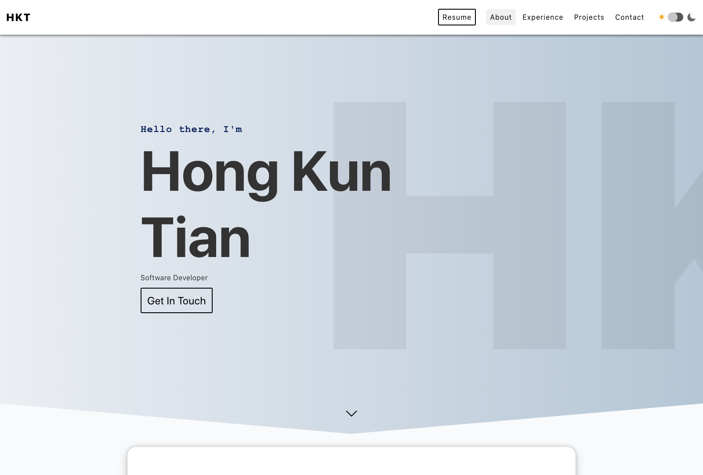
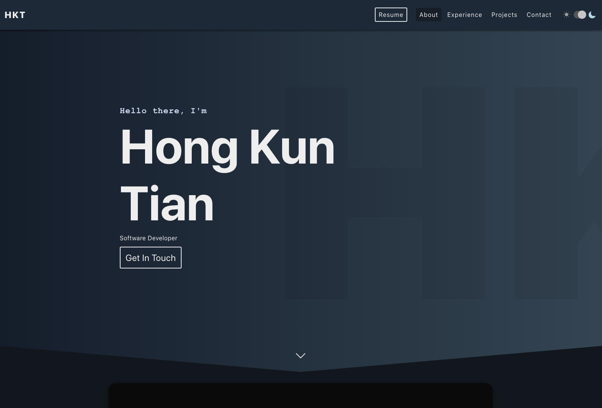

# My Portfolio Website
Visit my website at <a href="https://hongkuntian.com" text-align="center">hongkuntian.com</a>

## Features

* Responsive design that works well on any device (heavily leveraging the use of flexboxes)
* Dark mode that adapts to device preference and also retains user preference on browser local storage

## Planned improvements and additions

* Design and implement a more scalable display for Experience section such that multiple entries are easily viewable
* Add education history
